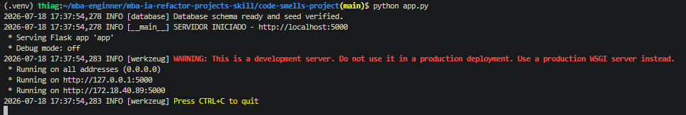
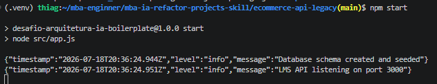
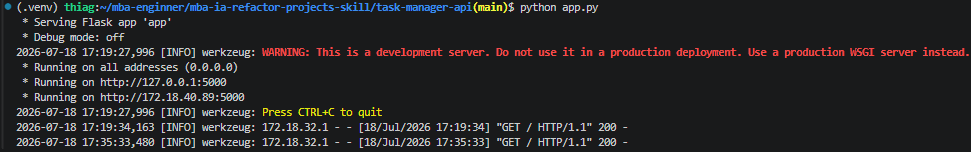

# Criação de Skills — Refatoração Arquitetural Automatizada

## A) Análise Manual
## code-smells-project

### PROBLEMAS

- CRITICAL: Credencial hardcoded no código: ``app.config["SECRET_KEY"] = "minha-chave-super-secreta-123"``.

- MEDIUM: Queries N+1 no banco. Na função `get_pedidos_usuario` são feitas várias queries dentro de dois `for` aninhados: uma pra buscar os pedidos, outra pros itens de cada pedido e outra pros produtos de cada item.

- MEDIUM: Faltam validações nos endpoints de usuário. Por exemplo, a rota que deleta um produto não checa o usuário — dá pra deletar sem estar logado, o que é uma falha de segurança.

- LOW: Magic numbers: há números soltos no código. O ideal seria guardá-los em variáveis com nome que explique o que são.
```python
    if faturamento > 10000:
        desconto = faturamento * 0.1
    elif faturamento > 5000:
        desconto = faturamento * 0.05
    elif faturamento > 1000:
        desconto = faturamento * 0.02
```

- LOW: Variáveis misturando dois idiomas (inglês e português), exemplo:
```python
    dados = request.get_json()
    query = dados.get("sql", "")
```


## ecommerce-api-legacy
### PROBLEMAS

- CRITICAL: Uma única classe ``AppManager`` fazendo tudo — uma "God Class".

- MEDIUM: Validação fraca: pra aprovar um cartão, a única checagem é o número começar com "4", exemplo:
```javascript
console.log(`Processando cartão ${cc} na chave ${config.paymentGatewayKey}`);
let status = cc.startsWith("4") ? "PAID" : "DENIED";
```

- MEDIUM: As rotas "/api/admin/financial-report" e "/api/users/:id" estão abertas, sem nenhum middleware ou guard pra restringir o acesso.

- LOW: Problemas de legibilidade: várias variáveis têm nomes que não dizem nada, o que dificulta entender cada dado. Exemplo:
```javascript
let u = req.body.usr;
let e = req.body.eml;
let p = req.body.pwd;
let cid = req.body.c_id;
let cc = req.body.card;

if (!u || !e || !cid || !cc) return res.status(400).send("Bad Request");
```

- LOW: Magic number no arquivo ``utils.js``: dentro da função ``badCrypto`` tem um ``10000`` solto, veja:
```javascript
 for(let i = 0; i < 10000; i++) {
        hash += Buffer.from(pwd).toString('base64').substring(0, 2);
    }
```

## task-manager-api
### PROBLEMAS

- HIGH: Regra de negócio pesada dentro das funções dos controllers.

- MEDIUM: Código duplicado. O trecho abaixo se repete em pelo menos sete pontos do projeto, com só pequenas variações:
```python
if t.due_date < datetime.utcnow():
            if t.status != 'done' and t.status != 'cancelled':
```

- MEDIUM: O GET /tasks não tem paginação. Conforme os dados crescem, isso pode virar um gargalo.

- LOW: Magic numbers. Em ``user_report`` tem um if com ``t.priority <= 2``; o ideal seria usar um enum ou uma constante pro nível de prioridade.

- LOW: Regex de validação de email repetido no arquivo ``user_routes`` (aparece duas vezes), sendo que já existe um em ``helpers.py``.

## B) Construção da Skill

### Como estruturei o SKILL.md e os arquivos de referência

Dividi a skill em duas partes: uma que decide o que fazer e outra que guarda o
conhecimento.

- **`SKILL.md`** é curto e funciona como o cérebro. Ele diz qual é o papel do
  agente, define que a Fase 2 sempre para e pede confirmação antes de mexer nos
  arquivos, e organiza as 3 fases nesta ordem: Análise → Auditoria → Refatoração.
- **Arquivos de referência** guardam o conteúdo, e cada fase lê só o que precisa
  no momento certo. Assim a skill gasta menos contexto:
  - `01-project-analysis.md` — como descobrir linguagem, framework, banco e
    arquitetura.
  - `02-antipatterns-catalog.md` — a lista de anti-patterns.
  - `03-report-template.md` — o formato do relatório da Fase 2.
  - `04-mvc-guidelines.md` — como a estrutura MVC deve ficar.
  - `05-refactoring-playbook.md` — como corrigir cada problema (antes → depois).
- Cada anti-pattern do catálogo aponta para a correção certa no playbook, ligando
  "achar o problema" a "resolver o problema".
- A **Fase 3 roda em um subagente**, porque é a parte mais pesada (ler o projeto
  inteiro e refatorar). Isso evita encher o contexto da conversa principal.

### Quais anti-patterns incluí no catálogo e por quê

Coloquei **18 anti-patterns** e uma lista de **APIs deprecated**, cobrindo as
quatro severidades. Escolhi cada um com base nos problemas reais que encontrei na
análise manual dos 3 projetos:

- **CRITICAL** — SQL Injection, endpoint que roda SQL arbitrário, credenciais no
  código, senha insegura e God Class.
- **HIGH** — regra de negócio na camada errada, estado global mutável, código
  acoplado sem injeção de dependência, rota sensível sem autenticação e callback
  hell.
- **MEDIUM** — queries N+1, falta de paginação, validação duplicada, tratamento
  de erro genérico e CORS/ambiente inseguro.
- **LOW** — magic numbers, log com `print`/`console.log` e nomes ruins/imports
  não usados.

Tomei dois cuidados: cada anti-pattern mostra um sinal concreto de como
identificá-lo (não só "código ruim") e também o que **não** confundir com ele
(ex.: query parametrizada não é SQL Injection), para evitar falso positivo. O
mínimo pedido era 8; entreguei 18 para cobrir bem os três projetos.

### Como garanti que a skill funciona em qualquer tecnologia

- A skill nunca chuta a stack: ela **detecta primeiro** e usa isso para guiar o
  resto do trabalho.
- A detecção é feita por sinais (extensões, arquivos de dependência, imports), e
  não por suposição fixa.
- Nenhum nome de arquivo ou entidade fica fixo no código — a skill trabalha com o
  que realmente encontra.
- O playbook traz exemplos em mais de uma linguagem (Python e Node).
- O código novo é escrito em inglês, mas sem traduzir rota, campo JSON ou tabela
  que já existe (isso quebraria o cliente e o banco).
- Testei nos 3 projetos: dois em Python/Flask e um em Node.js/Express.

### Desafios encontrados e como resolvi

- **Cada projeto usava uma arquitetura bem diferente.** Esse foi o ponto mais
  difícil. Um era um monolito flat, outro girava em torno de uma God Class e o
  terceiro já tinha um MVC pela metade. Fazer a mesma skill dar conta dos três
  deu trabalho: no começo ela tentava aplicar sempre o mesmo passo a passo e
  acabava reescrevendo coisa que já estava boa. Resolvi fazendo a skill primeiro
  entender o ponto de partida e só então decidir se criava as camadas do zero ou
  se apenas completava o que faltava.
- **Contexto estourava na Fase 3.** Como refatorar exige ler o projeto inteiro,
  a conversa principal enchia rápido. Resolvi passando essa fase para um
  subagente, já com tudo o que ele precisa em mãos.
- **A skill inventava problemas (falsos positivos).** Ela marcava, por exemplo,
  uma query segura como SQL Injection. Resolvi criando regras de "não confundir"
  e deixando claro que ela não deve apontar problema sem prova.
- **View nem sempre existe.** Ao refatorar, vi que alguns projetos não tinham de
  fato uma camada de view, e que ficar só com "Controller" e "Model" ainda deixava
  o código bem bagunçado. Por isso deixei a view como opcional e defini no
  ``04-mvc-guidelines.md`` algumas camadas de apoio (`config/`, `services/`,
  `middlewares/`) pra organizar o que sobrava.
- **Não quebrar o que os clientes já usam ao renomear para inglês.** Resolvi
  separando o nome interno (que pode ser traduzido) do contrato externo (que não
  pode: rota, campo JSON e tabela), e conferindo com o boot da app mais uma
  chamada aos endpoints.
- **Manter uma qualidade mínima na auditoria.** Defini uma meta: sempre pelo menos
  5 findings, sendo pelo menos 1 CRITICAL ou HIGH.

## C) Resultados

### 1. Resumo dos relatórios de auditoria

Findings por severidade em cada projeto (os relatórios completos estão em
`reports/audit-project-{1,2,3}.md`):

| Projeto | Stack | CRITICAL | HIGH | MEDIUM | LOW | Total |
| ------- | ----- | :------: | :--: | :----: | :-: | :---: |
| code-smells-project | Python 3.12 / Flask 3.1.1 | 5 | 4 | 5 | 3 | **17** |
| ecommerce-api-legacy | Node.js / Express 4.18 | 4 | 5 | 3 | 3 | **15** |
| task-manager-api | Python 3 / Flask 3.0 + SQLAlchemy | 2 | 3 | 5 | 3 | **13** |
| **Total** | | **11** | **12** | **13** | **9** | **45** |

Destaques de cada projeto:

- **code-smells-project** — o mais grave: SQL Injection em quase toda query,
  endpoint que roda SQL arbitrário via HTTP, reset do banco sem autenticação,
  secret no código e senhas em texto puro.
- **ecommerce-api-legacy** — dominado pela `God Class` `AppManager`, que fazia
  tudo (banco + rotas + regra), além de credenciais no código, hash feito na mão
  e `DELETE /users/:id` sem autenticação.
- **task-manager-api** — o mais organizado logo de início (já tinha as camadas
  esboçadas), mas com regra de negócio nos controllers, MD5 sem salt, token
  falso e pastas de camadas vazias.

### 2. Comparação antes/depois da estrutura

**code-smells-project** — monolito flat → MVC completo, criado do zero:

```
ANTES                          DEPOIS
app.py                         app.py                (entry point)
controllers.py                 config/               (settings + constants)
database.py                    controllers/          (6 controllers por domínio)
models.py                      models/               (repositories)
requirements.txt               services/             (regra de negócio)
                               views/routes.py       (rotas)
                               middlewares/          (auth + error_handler)
                               utils/                (security, validators, serializers)
```

**ecommerce-api-legacy** — `God Class` decomposta em camadas:

```
ANTES                          DEPOIS
src/AppManager.js  (God Class) src/config/           (settings + constants)
src/app.js                     src/controllers/      (admin, checkout, user)
src/utils.js                   src/services/         (checkout, report, paymentGateway)
                               src/models/           (course, user, payment, ...)
                               src/routes/           (index)
                               src/middlewares/      (auth, errorHandler, asyncHandler)
                               src/lib/              (db, cache, logger, password)
                               src/db/ + src/errors/
```

**task-manager-api** — MVC parcial → camadas completadas:

```
ANTES                          DEPOIS (adiciona/preenche)
models/                        + controllers/        (regra tirada das rotas)
routes/                        + repositories/       (acesso a dados)
services/ (vazio)              + schemas/            (validação)
utils/                         + config/ + middlewares/ (auth, error_handler)
config/ schemas/ (vazias)      services/ agora usados (auth, task, report, ...)
```

A skill se ajustou ao ponto de partida: nos dois primeiros ela criou as camadas
do zero; no terceiro só corrigiu e preencheu o que faltava, sem reescrever o que
já estava bom.

### 3. Checklist de validação

<table>
<tr><th>Item</th><th>code-smells</th><th>ecommerce</th><th>task-manager</th></tr>
<tr><td colspan="4"><b>Fase 1 — Análise</b></td></tr>
<tr><td>Linguagem detectada corretamente</td><td>✅</td><td>✅</td><td>✅</td></tr>
<tr><td>Framework detectado corretamente</td><td>✅</td><td>✅</td><td>✅</td></tr>
<tr><td>Domínio da aplicação descrito corretamente</td><td>✅</td><td>✅</td><td>✅</td></tr>
<tr><td>Nº de arquivos analisados condiz com a realidade</td><td>✅</td><td>✅</td><td>✅</td></tr>
<tr><td colspan="4"><b>Fase 2 — Auditoria</b></td></tr>
<tr><td>Relatório segue o template de referência</td><td>✅</td><td>✅</td><td>✅</td></tr>
<tr><td>Cada finding tem arquivo e linhas exatos</td><td>✅</td><td>✅</td><td>✅</td></tr>
<tr><td>Findings ordenados por severidade</td><td>✅</td><td>✅</td><td>✅</td></tr>
<tr><td>Mínimo de 5 findings identificados</td><td>✅ (17)</td><td>✅ (15)</td><td>✅ (13)</td></tr>
<tr><td>Detecção de APIs deprecated (se aplicável)</td><td>✅</td><td>✅</td><td>✅</td></tr>
<tr><td>Skill pausa e pede confirmação antes da Fase 3</td><td>✅</td><td>✅</td><td>✅</td></tr>
<tr><td colspan="4"><b>Fase 3 — Refatoração</b></td></tr>
<tr><td>Estrutura de diretórios segue padrão MVC</td><td>✅</td><td>✅</td><td>✅</td></tr>
<tr><td>Configuração extraída para módulo (sem hardcoded)</td><td>✅</td><td>✅</td><td>✅</td></tr>
<tr><td>Models criados para abstrair dados</td><td>✅</td><td>✅</td><td>✅</td></tr>
<tr><td>Views/Routes separadas</td><td>✅</td><td>✅</td><td>✅</td></tr>
<tr><td>Controllers concentram o fluxo</td><td>✅</td><td>✅</td><td>✅</td></tr>
<tr><td>Error handling centralizado</td><td>✅</td><td>✅</td><td>✅</td></tr>
<tr><td>Entry point claro</td><td>✅</td><td>✅</td><td>✅</td></tr>
<tr><td>Aplicação inicia sem erros</td><td>✅</td><td>✅</td><td>✅</td></tr>
<tr><td>Endpoints originais respondem corretamente</td><td>✅</td><td>✅</td><td>✅</td></tr>
</table>

### 4. Aplicações rodando após a refatoração

Logs de inicialização de cada projeto depois da refatoração, todos subindo sem
erros:

**code-smells-project** — Flask sobe na porta 5000, com schema e seed conferidos:



**ecommerce-api-legacy** — API Node/Express na porta 3000, schema criado e populado:



**task-manager-api** — Flask na porta 5000 respondendo `GET /` com `200`:



### 5. Observações sobre a skill em stacks diferentes

- **Funciona mesmo em qualquer tecnologia.** A mesma skill rodou em Python/Flask
  (SQLite direto), Node/Express (SQLite com callbacks) e Python/Flask-SQLAlchemy,
  descobrindo a stack e o banco por sinais, sem nada fixo no código.
- **Adaptar-se ao ponto de partida fez toda a diferença.** Monolito flat, `God
  Class` e MVC pela metade pediram estratégias diferentes: criar as camadas do
  zero em dois casos e só completar/corrigir no terceiro — a skill não reescreveu
  o que já estava certo.
- **As camadas de apoio importaram mais que a "View".** Nenhum projeto tinha uma
  view de verdade; o ganho real veio de `services/`, `config/`, `middlewares/` e
  (quando fazia sentido) `repositories/`. Deixar a view opcional foi a escolha
  certa.
- **O contrato externo foi mantido nas três stacks.** A tradução para inglês ficou
  só no código interno; as rotas, os campos JSON e as tabelas que já existiam
  foram preservados, então a app continuou subindo e os endpoints seguiram
  respondendo igual.
- **As correções se repetem entre as linguagens.** Secrets → variáveis de
  ambiente, hash fraco → bcrypt/argon2, N+1 → JOIN e rota sensível → middleware de
  auth apareceram nos três, mostrando que o playbook cobre bem os problemas
  comuns, não importa a linguagem. A maior diferença foi o Node, onde o callback
  hell exigiu um passo a mais (trocar para `async/await`) que os projetos Python
  não precisaram.

## D) Como Executar

### Pré-requisitos

- **[Claude Code](https://claude.com/claude-code)** instalado e autenticado (foi a
  ferramenta usada neste desafio). A skill `refactor-arch` já vem dentro de cada
  projeto em `.claude/skills/refactor-arch/`, então o Claude Code a reconhece
  sozinho ao abrir o projeto.
- Para **rodar** os projetos depois da refatoração:
  - **Python** (code-smells-project, task-manager-api): Python 3.10+ e `pip`.
  - **Node.js** (ecommerce-api-legacy): Node.js 18+ e `npm`.

### Executar a skill em cada projeto

A skill roda de dentro de cada projeto. Abra o Claude Code na raiz do projeto e
chame a skill pelo slash command — ela executa as 3 fases (análise → auditoria →
refatoração) e **para para pedir confirmação `y`** antes de alterar qualquer
arquivo.

```bash
# Projeto 1 — code-smells-project (Python/Flask)
cd code-smells-project
claude          # dentro da sessão, rode: /refactor-arch

# Projeto 2 — ecommerce-api-legacy (Node/Express)
cd ecommerce-api-legacy
claude          # dentro da sessão, rode: /refactor-arch

# Projeto 3 — task-manager-api (Python/Flask + SQLAlchemy)
cd task-manager-api
claude          # dentro da sessão, rode: /refactor-arch
```

> Em vez do slash command, você também pode pedir em linguagem natural, por ex.
> _"analise a arquitetura e refatore este projeto para MVC"_ — a skill é acionada
> pela descrição. O relatório de auditoria fica em `reports/audit-project.md` na
> raiz do projeto.

### Validar que a refatoração funcionou

A refatoração aplicou o mesmo modelo de camadas nos três projetos, com uma regra
principal: **cada camada tem uma única responsabilidade e as dependências entram
de fora para dentro, sempre injetadas** (nunca criadas por quem as usa). Nenhuma
camada acessa a de baixo "pulando" a do meio.

### O que cada camada faz

| Camada | Responsável por | **Não** contém |
| ------ | --------------- | -------------- |
| `config/` | Ler configuração das variáveis de ambiente (secret, debug, CORS, conexão) | Segredos no código, lógica |
| `routes`/`views` | Ligar URL + método HTTP → método do controller | Regra de negócio, SQL |
| `controllers/` | Cuidar do request: validar entrada, chamar o service e montar a resposta HTTP | SQL, cálculo de negócio, efeitos colaterais |
| `services/` | Regra de negócio e efeitos colaterais (notificação, pagamento, desconto) | SQL cru, detalhes de HTTP |
| `models`/`repositories/` | Acesso a dados: queries parametrizadas e transformar linha→objeto | Regra de negócio, roteamento |
| `middlewares/` | Autenticação/autorização e **tratamento de erro centralizado** | Regra de domínio |
| `utils/` (`security`, `validators`, `serializers`) | Apoio geral: hash de senha, validação e serialização sem campos sensíveis | Estado, acesso a banco |
| entry point (`app.py`/`app.js`) | **Composition root**: criar e injetar tudo, registrar rotas e middlewares | Qualquer regra de negócio |

### O caminho de um request

Depois da refatoração, toda requisição segue sempre o mesmo caminho, com cada
etapa separada da seguinte:

```
request → route → controller → service → repository/model → DB
                     │            │              │
                validação    regra de       queries
                + resposta    negócio     parametrizadas
```

Exemplo real de `POST /produtos` no **code-smells-project**:

- **route** (`views/routes.py`) — só liga o path ao método:
  `app.add_url_rule("/produtos", "criar_produto", product.create_product, methods=["POST"])`.
- **controller** (`ProductController.create_product`) — valida o payload e devolve
  a resposta HTTP; não sabe o que é SQL:
  `data = validate_product_payload(request.get_json()); id = self._service.create_product(data)`.
- **service** (`ProductService.create_product`) — aplica a regra e faz o log; não
  sabe o que é `request` nem `cursor`.
- **repository** (`ProductRepository.create`) — a única camada que fala com o
  banco, e **sempre com valores parametrizados** (`INSERT ... VALUES (?, ?, ?, ?,
  ?)`), o que eliminou o SQL Injection original.

### Como as dependências são ligadas (injeção)

Toda a ligação acontece em **um só lugar** — o composition root. Ninguém cria a
própria dependência com `new`/`import` no meio do código; ela chega pelo
construtor. É isso que deixa cada camada fácil de testar e de trocar por um mock.

```python
# code-smells-project/app.py  (composition root)
product_repository = ProductRepository(get_connection)      # repo recebe a conexão
product_service    = ProductService(product_repository)     # service recebe o repo
controllers["product"] = ProductController(product_service) # controller recebe o service
```

No **ecommerce-api-legacy** o mesmo padrão desfaz a `God Class` `AppManager`:
`bootstrap()` cria os models, injeta eles nos services (`CheckoutService`,
`FinancialReportService`), injeta os services nos controllers e só então registra
rotas e middlewares — cada parte que antes ficava amontoada em uma classe agora é
uma dependência clara.

### O que cada correção virou, no código

- **Segredo no código → `config/`**: valores lidos de `os.environ` /
  `process.env`, com placeholders só para desenvolvimento.
- **Senha insegura → `utils/security` + `lib/password`**: hash com `bcrypt`, e o
  campo `password` **removido da serialização** (o serializer/schema nunca mostra
  o hash).
- **Regra de negócio no controller/model → `services/`**: cálculo de total,
  desconto e notificações foram para services próprios (ex.:
  `NotificationService`, `PaymentGateway`).
- **N+1 → `repository` com JOIN**: os loops de query aninhados viraram uma única
  consulta com JOIN dentro do repositório.
- **Rota sensível sem auth → `middlewares/auth`**: as rotas de admin/destrutivas
  passam por um guard (`require_admin`); o endpoint que rodava SQL cru foi
  **removido**.
- **`try/except` genérico → `middlewares/error_handler`**: um handler central
  transforma exceções de domínio (`AppError`/`NotFoundError`) no status HTTP certo
  e num formato de resposta padronizado, sem vazar stack trace para o cliente.

### Diferença entre os três projetos

O esqueleto de camadas é o mesmo, mas a profundidade mudou conforme o ponto de
partida:

- **code-smells-project** e **ecommerce-api-legacy** foram quebrados **do zero**
  em `config → routes → controllers → services → models/repositories`.
- **task-manager-api**, que já tinha `models/` e `routes/`, ganhou as camadas que
  faltavam: os controllers pararam de ter regra (ficaram finos, só chamando os
  `services/`), a validação foi para `schemas/`, o acesso a dados foi isolado em
  `repositories/` e a serialização passou a usar schemas que **não** mostram
  campos sensíveis.
